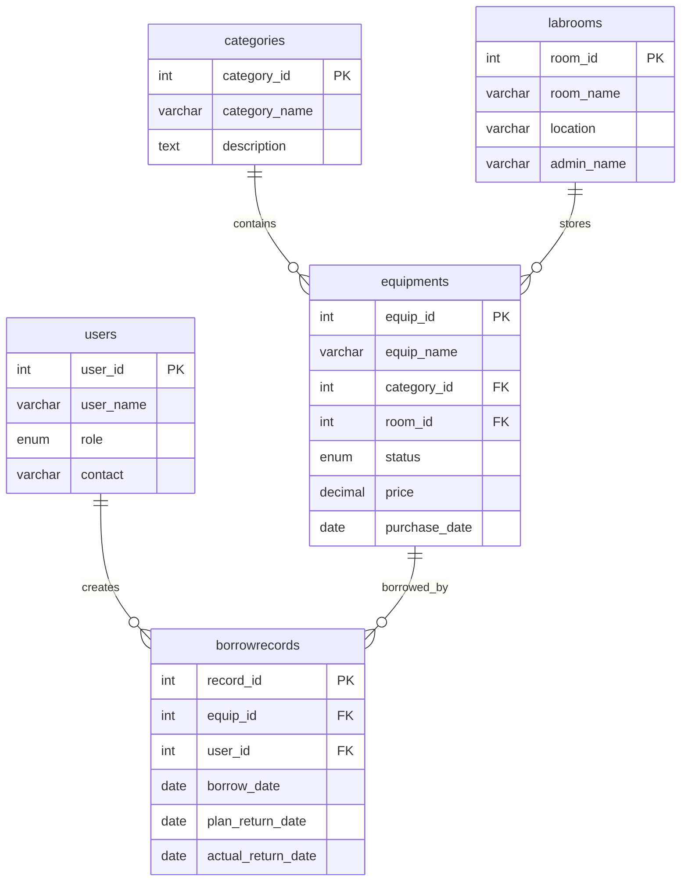

# 实验室设备管理系统 ER 模型

## 1. 实体

- 设备类别：`category_id`、`category_name`、`description`
- 实验室房间：`room_id`、`room_name`、`location`、`admin_name`
- 用户：`user_id`、`user_name`、`role`、`contact`
- 设备：`equip_id`、`equip_name`、`status`、`price`、`purchase_date`
- 借用记录：`record_id`、`borrow_date`、`plan_return_date`、`actual_return_date`

## 2. 联系

- 一个设备类别可以包含多台设备，一台设备只能属于一个类别。
- 一个实验室房间可以放置多台设备，一台设备只能位于一个房间。
- 一个用户可以产生多条借用记录，一条借用记录只能属于一个用户。
- 一台设备可以有多条历史借用记录，一条借用记录只能对应一台设备。

## 3. Mermaid ER 图

